```markdown
# Galactic Transaction Ledger

A Java console application that allows users to manage a personal financial ledger for deposits and payments.
The app supports adding transactions, viewing all or filtered transactions, and calculating a running balance.
Data is stored in a CSV file to persist across sessions.

## Features

- Add deposits or payments with automated or user-defined descriptions and vendors.
- View a ledger of all transactions, or filter by deposits, payments, month-to-date, previous month, year-to-date, previous year, or vendor.
- Transactions are displayed in chronological order with formatted columns for easy reading.
- Calculates and displays the current account balance.
- Data persistence using a CSV file (`transactions.csv`) for transaction storage.
- Defensive coding to handle invalid user input.

## Classes Overview

### Main
Entry point of the application. Initializes the controller and starts the program loop.

### Transaction
Represents a single financial transaction with the following attributes:
- Date
- Time
- Description
- Vendor
- Amount

Provides a method to display transaction details in a formatted layout.

### Account
Manages a collection of `Transaction` objects and the account balance.  
Key responsibilities:
- Adding transactions
- Calculating current balance
- Generating transaction reports with filtering options
- Displaying formatted titles and balances

### FileManager
Handles reading and writing transactions to and from `transactions.csv`.  
- Reads existing transactions into a list on startup.
- Updates the CSV file when new transactions are added.

### Controller
Handles user interaction and program flow.  
- Displays menus (main, ledger, and reports)
- Prompts users for input and validates it
- Creates new transactions and updates the account and CSV file
- Provides default random descriptions and vendors for deposits

## Data Storage

All transactions are stored in `src/main/resources/transactions.csv` in the following format:

```

YYYY-MM-DD|HH:MM:SS|Description|Vendor|Amount

```

Example:
```

2025-10-15|17:25:16|Deposit - Fleet Rebate|Cosmic Trade Bank|4000.00

2025-10-15|17:21:40|Payment - Asteroid Dust Cleaning Fee|Orbit Wash Service|-1000.00

```

## Screenshots

1. Main Menu display
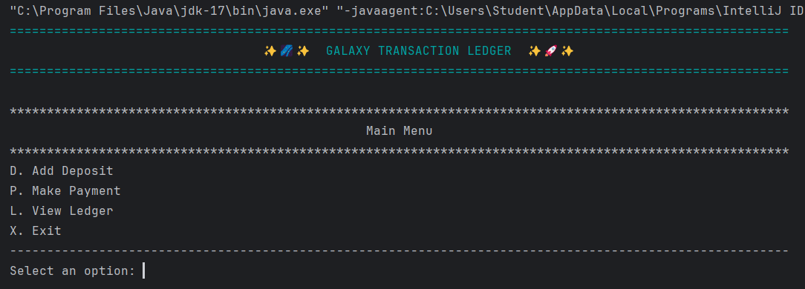
2. Adding a deposit
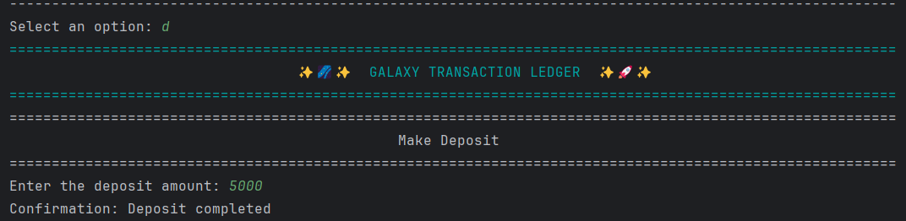
3. Adding a payment
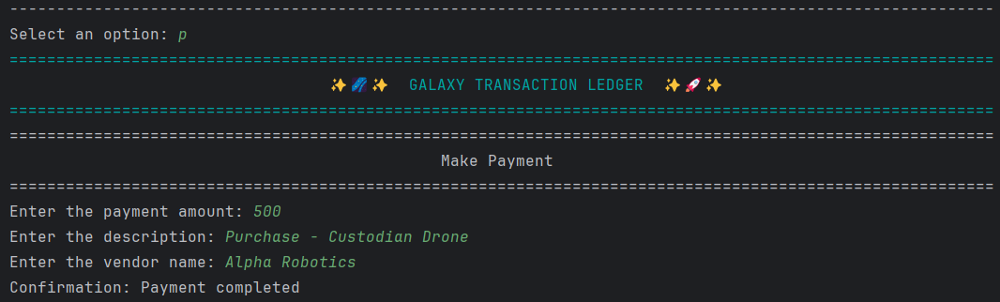
4. Ledger Menu display
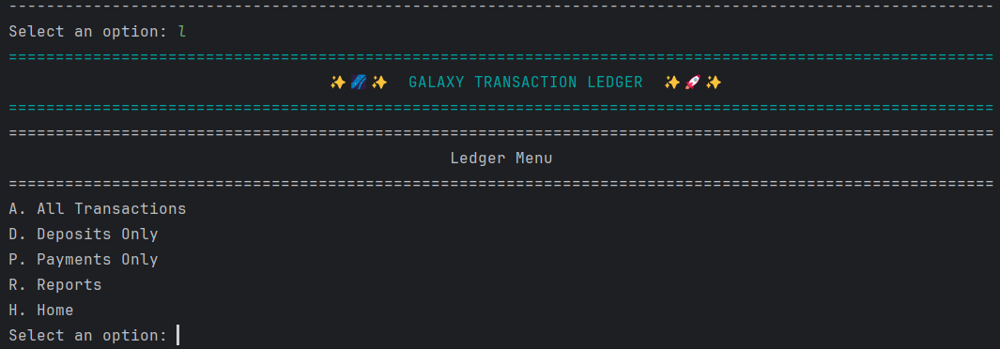
5. Ledger showing all transactions
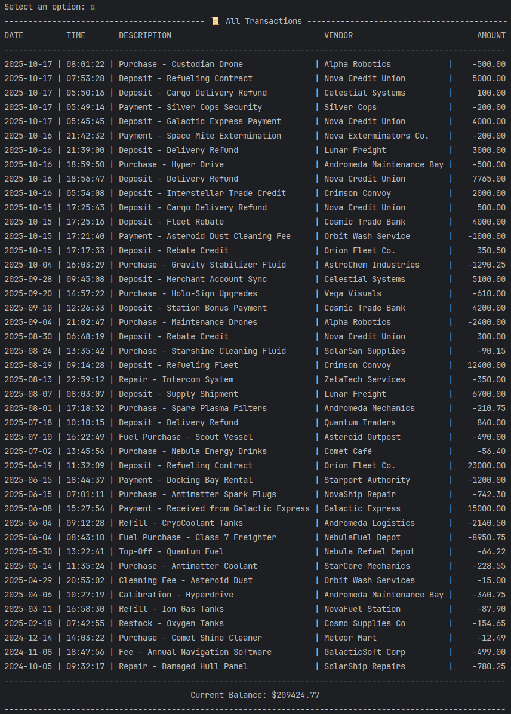
6. Ledger filtered by deposits
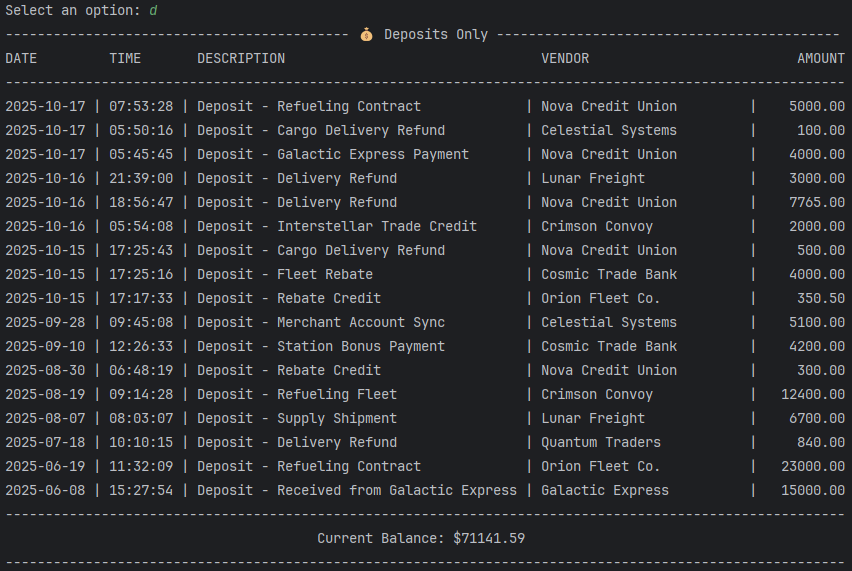
7. Ledger filtered by payments
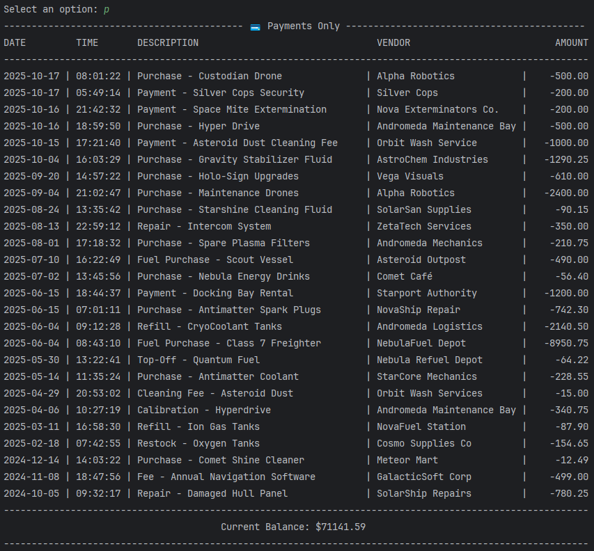
8. Reports menu
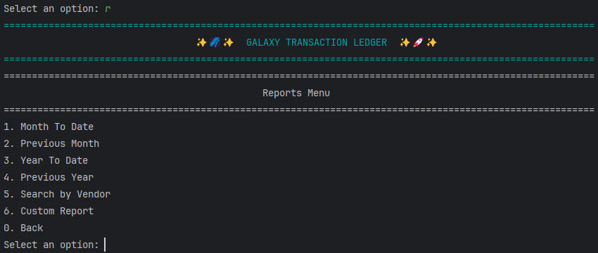
9. Ledger filtered by vendor
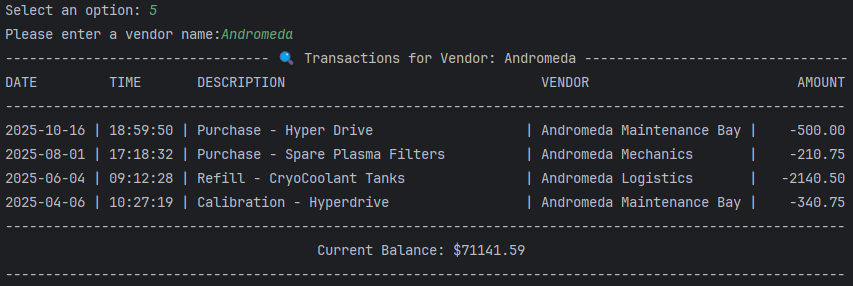
10. Reports filtered by previous year
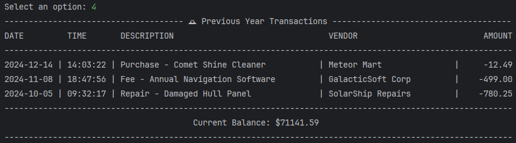
11. Custom Reports filtered by month
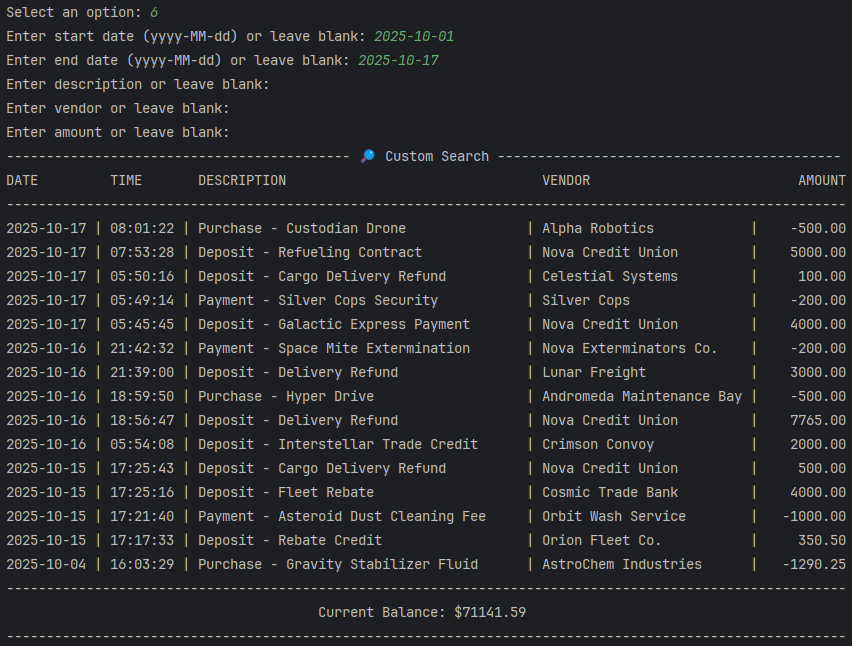
12. Exit/Back Process
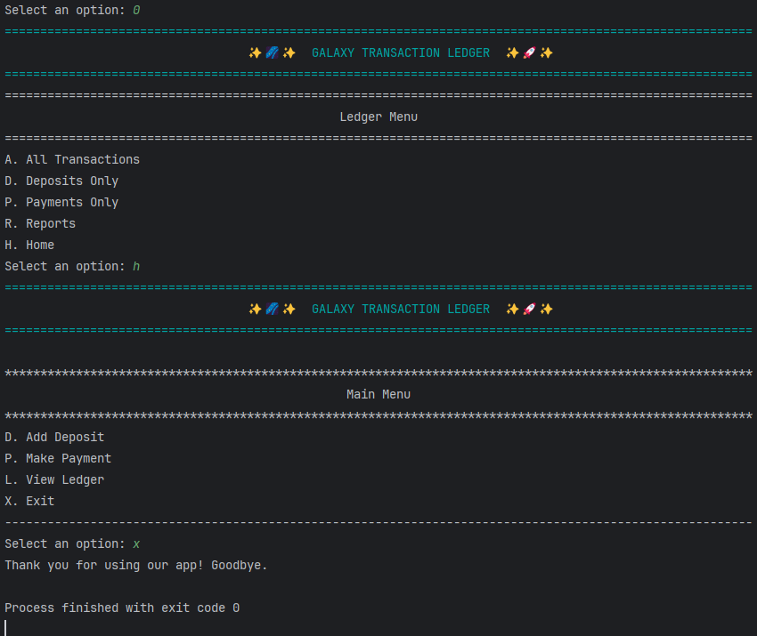

## How to Run

1. Clone the repository.
2. Open the project in your Java IDE or compile via the command line.
3. Run the `Main` class.
4. Interact with the menus to add transactions, view ledger entries, or generate reports.

## Author

Zackery Aguirre
```
